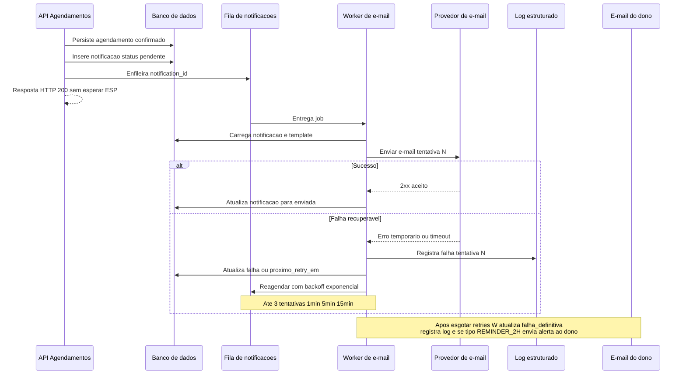

# 07 — Diagrama de sequência: disparo de notificação com retry

Fluxo genérico de envio assíncrono com falha transitória e política de falha definitiva. A decisão de **alertar ou não o dono** ocorre no worker conforme o **tipo** da notificação (ver [USER_STORIES.md](../../USER_STORIES.md)).

**Notas:**

- Para `BOOKING_CONFIRMATION`, `REMINDER_24H`, `CANCEL_CONFIRM_CLIENT` e `OWNER_CANCELLED_BY_CLIENT`, o bloco `opt Apenas se tipo REMINDER_2H` **não** executa: apenas log na falha definitiva (conforme política acordada).
- A API de cancelamento segue padrão análogo: persistência → notificações enfileiradas → workers independentes.
