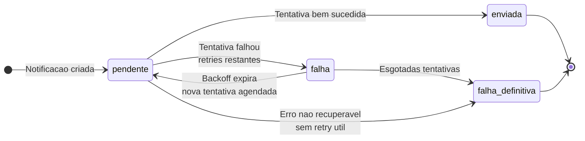
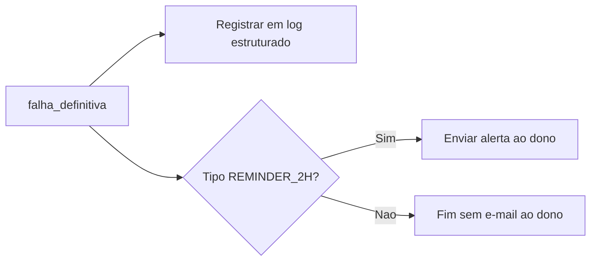

# 07 — Diagrama de estados: ciclo de vida de uma notificação

Cada envio de e-mail (ou unidade lógica de notificação) percorre estados até **enviada** ou **falha_definitiva**. Retries podem ser modelados como transições a partir de **falha** com retorno a **pendente** agendado, ou como subestados; abaixo, visão consolidada.

---

## Estados

| Estado | Significado |
|--------|-------------|
| `pendente` | Criada e aguardando primeira tentativa ou próximo retry agendado. |
| `enviada` | Provedor aceitou o envio com sucesso (conforme critério do conector). |
| `falha` | Última tentativa falhou; ainda há retries restantes **ou** está em backoff antes da próxima. |
| `falha_definitiva` | Esgotadas todas as tentativas; nenhum novo envio automático. |

**Política pós-falha_definitiva:** conforme tipo — log; e para lembrete **2h**, também e-mail ao dono (ver módulo 07 USER_STORIES).

---

## Diagrama (Mermaid)

---

## Transição implícita: ações ao entrar em `falha_definitiva`

Este fluxo complementa o [diagrama de sequência](../sequence/flow.md).
