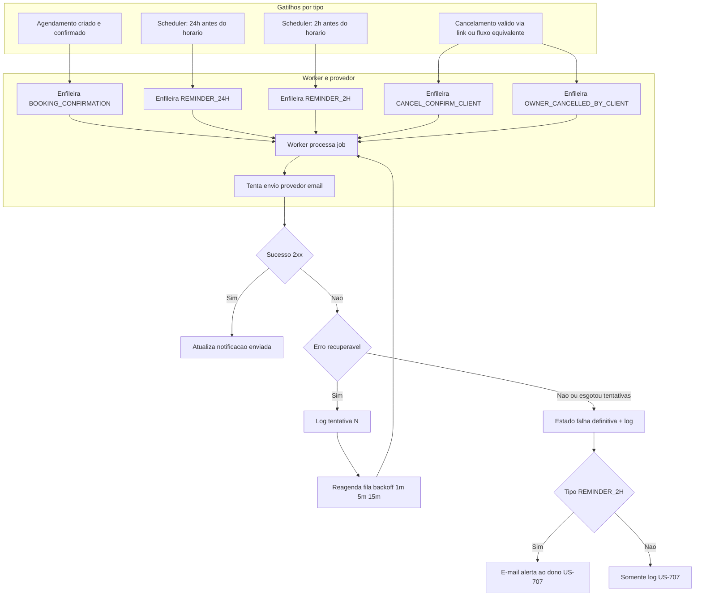

# 07 — Diagrama de fluxo: notificações, gatilhos e retry

Visão em flowchart dos **gatilhos** por tipo de notificação, do **retry** em falha transitória e da **decisão** de alertar o dono quando o lembrete crítico (2h) falha de forma definitiva. Detalhe de sequência worker ↔ provedor: [sequence/flow.md](../sequence/flow.md). Política de produto: [USER_STORIES.md](../../USER_STORIES.md).

**Idempotência:** o alerta ao dono para falha definitiva do lembrete **2h** não deve duplicar para o mesmo evento de falha (US-703 / US-707).

**Resumo da política (após esgotar retries):**

| Tipo (conceitual) | Falha definitiva |
|-------------------|------------------|
| Confirmação de agendamento | Apenas log |
| Lembrete 24h | Apenas log |
| Lembrete 2h | Log + e-mail ao dono |
| Confirmação cancelamento cliente | Apenas log |
| Notificação ao dono (cliente cancelou) | Apenas log |

Parâmetros sugeridos: até **3 tentativas**, intervalos **1 min → 5 min → 15 min** (configurável por ambiente).
