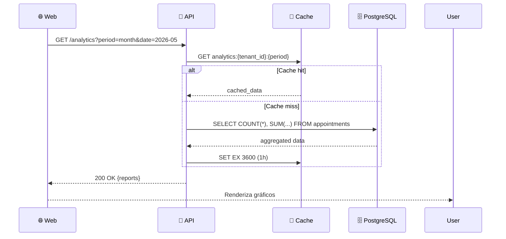

# 09-Relatorios — Estado, Sequence, Wireframes, ERD

[Ver user-flow para tudo]

## Sequence: Load Analytics

```mermaid
sequenceDiagram
    participant Web as 🌐 Web
    participant API as 🚀 API
    participant Cache as 💾 Cache
    participant DB as 🗄️ PostgreSQL
    
    Web->>API: GET /analytics?period=month&date=2026-05
    API->>Cache: GET analytics:{tenant_id}:{period}
    alt Cache hit
        Cache-->>API: cached_data
    else Cache miss
        API->>DB: SELECT COUNT(*), SUM(...) FROM appointments
        DB-->>API: aggregated data
        API->>Cache: SET EX 3600 (1h)
    end
    API-->>Web: 200 OK {reports}
    Web-->>User: Renderiza gráficos
```
