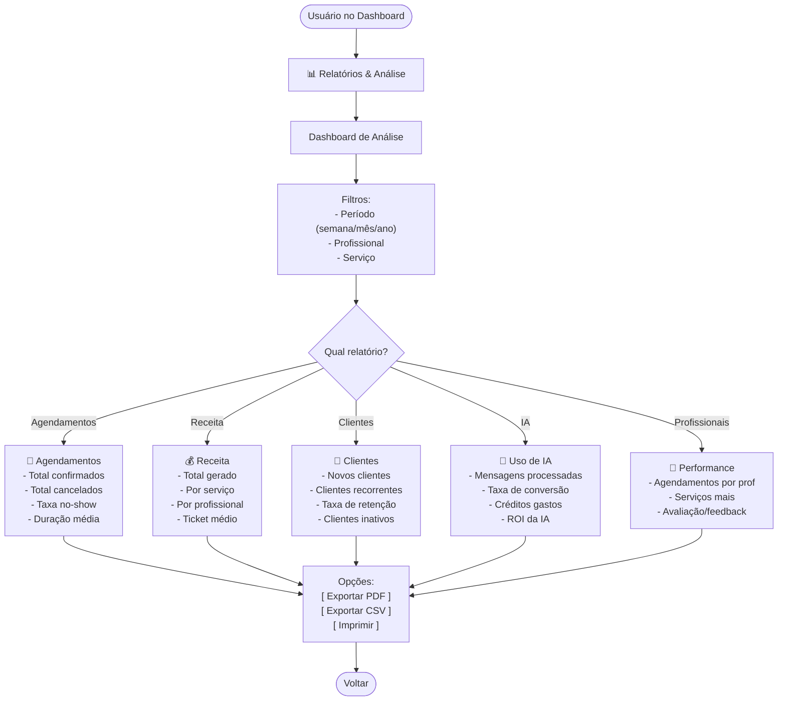
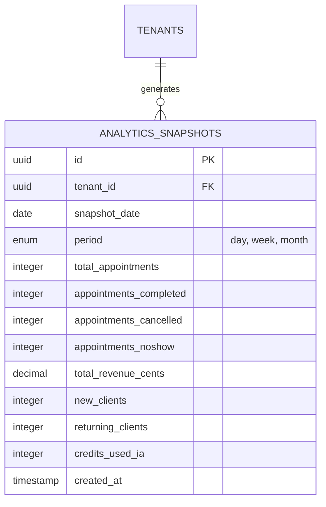
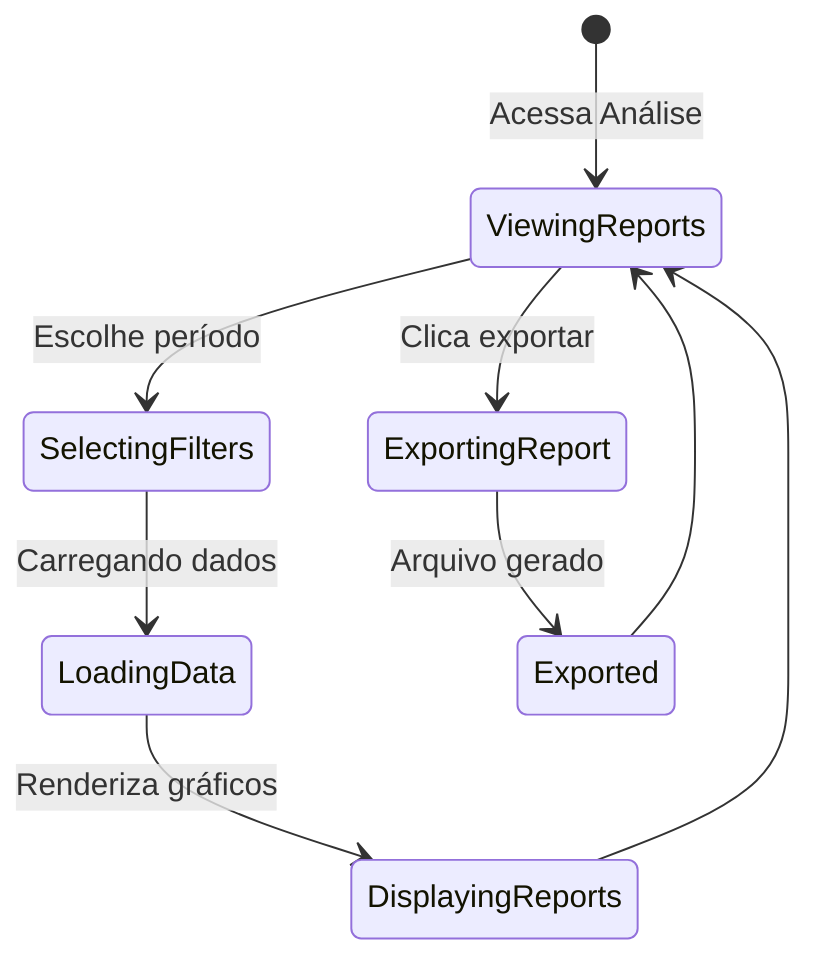

# 09-Relatorios-Análise — Fluxo

## User Flow



## ERD



## Wireframes

```
┌─────────────────────────────────────────────────────────┐
│  Relatórios & Análise                      [← Voltar]   │
├─────────────────────────────────────────────────────────┤
│                                                         │
│  Período: [Mês ▼] [Maio ▼] [2026 ▼]                    │
│                                                         │
│  📊 Resumo do Mês                                        │
│                                                         │
│  ┌──────────────┐ ┌──────────────┐ ┌──────────────┐    │
│  │ 📅 Appts     │ │ 💰 Receita   │ │ 👥 Clientes  │    │
│  │    245       │ │  R$ 8.575    │ │     89       │    │
│  │ ⬆️ +12% MoM  │ │ ⬆️ +18% MoM  │ │ ⬆️ +5% MoM   │    │
│  └──────────────┘ └──────────────┘ └──────────────┘    │
│                                                         │
│  📈 Gráficos de Tendência                               │
│                                                         │
│  Agendamentos diários:                                  │
│  10 │        ▁   ▂   ▃                                 │
│   8 │    ▃ ▄ █   █   █                                 │
│   6 │  ▂ █ █ █   █   █                                 │
│   4 │▁ █ █ █ █ ▂ █   █                                 │
│   2 │█ █ █ █ █ █ █ ▂ █                                 │
│   0 └─────────────────────────                         │
│     Seg Ter Qua Qui Sex Sab Dom                         │
│                                                         │
│  ─────────────────────────────────────────────────────  │
│                                                         │
│  📋 Relatórios Disponíveis:                             │
│                                                         │
│  [ Agendamentos ]  [ Receita ]  [ Clientes ]           │
│  [ IA Usage ]      [ Profissionais ]                    │
│                                                         │
│  [ 📥 Exportar PDF ]  [ 📥 Exportar CSV ]              │
│                                                         │
└─────────────────────────────────────────────────────────┘
```

## State / Sequence


