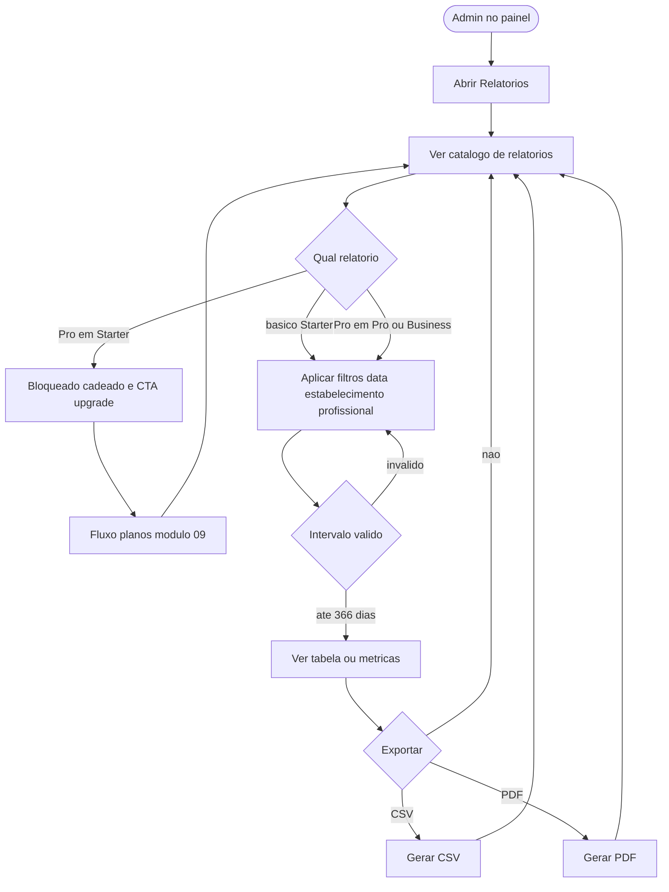

# Módulo 08 — Relatórios: fluxo do utilizador (AgendaIA)

Fluxo do dono no painel: catálogo → filtros → visualização → exportação; ramo Starter em relatório Pro.

Detalhe: [USER_STORIES.md](../../USER_STORIES.md), [step-by-step.md](../../step-by-step.md). Wireframe: [../wireframes/pages.md](../wireframes/pages.md).

---

## Flowchart

---

## Referências

- [USER_STORIES.md](../../USER_STORIES.md)  
- [step-by-step.md](../../step-by-step.md)
