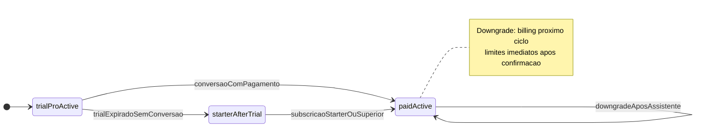
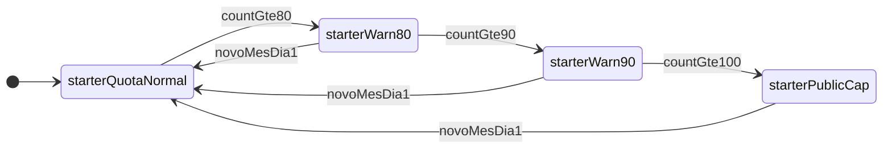

# Módulo 09 — Estados de plano, trial e limite Starter

Este ficheiro descreve **dois eixos** que convivem:

1. **Estado de subscrição / ciclo de vida** — trial, plano pago, transições de upgrade/downgrade e facturação.
2. **Estado operacional do limite mensal (Starter)** — contador mensal de agendamentos criados e alertas 80 / 90 / cap público; **reinicia no dia 1** (timezone do estabelecimento).

Detalhe funcional: [USER_STORIES.md](../../USER_STORIES.md). Fluxos narrativos: [step-by-step.md](../../step-by-step.md).

---

## Eixo A — Subscrição e trial

| Estado | Descrição |
|--------|-----------|
| `trialProActive` | Trial de 15 dias no tier Pro; sem cartão. |
| `paidActive` | Plano pago activo (Starter, Pro ou Business). |
| `starterAfterTrial` | Resultado automático quando `trialProActive` expira **sem** conversão; equivalente a Starter pago em termos de **limites**, sem estado de pagamento até haver método de cobrança (definir na implementação se “Starter gratuito pós-trial” ou “Starter a 0 até configurar pagamento”). |
| `pendingDowngrade` | Opcional: downgrade confirmado pelo utilizador mas **facturação** só no próximo ciclo; **limites** do plano de destino já aplicam após confirmação ([US-118](../../USER_STORIES.md)). Pode fundir-se com `paidActive` + metadados se preferirem um único estado. |
| `cancelled` | Subscrição cancelada (futuro / fora do âmbito mínimo do MVP se não existir cancelamento). |

**Transições principais:**

- `trialProActive` → `paidActive` — conversão com pagamento ([US-113](../../USER_STORIES.md)).
- `trialProActive` → `starterAfterTrial` — fim do trial sem conversão (downgrade automático para Starter).
- `paidActive` → `paidActive` — **upgrade**: efeito imediato em limites ([US-117](../../USER_STORIES.md)).
- `paidActive` → `paidActive` (tier menor) — **downgrade** após hard gate: facturação no **próximo ciclo**, limites do destino **imediatos após confirmação** ([US-118](../../USER_STORIES.md)).

---

## Eixo B — Limite mensal Starter (dentro de `paidActive` ou `starterAfterTrial` com tecto Starter)

Aplica-se apenas quando o **plano efectivo** inclui tecto de **100 agendamentos criados / mês**.

| Subestado | Descrição |
|-----------|-----------|
| `starterQuotaNormal` | Contagem mensal &lt; 80. |
| `starterWarn80` | Contagem ≥ 80 e &lt; 90. |
| `starterWarn90` | Contagem ≥ 90 e &lt; 100. |
| `starterPublicCap` | Contagem ≥ 100 — novos agendamentos **bloqueados na página pública**; painel com aviso e CTA upgrade ([US-116](../../USER_STORIES.md)). |

**Transições:** avançam com a contagem no mês; no **dia 1** (timezone do estabelecimento), a contagem zera e o subestado volta a `starterQuotaNormal` (salvo persistência de banners “novo mês” por UX).

Planos **Pro** e **Business** (ilimitado em agendamentos): não usam este eixo para cap público; podem omitir os subestados na UI.

---

## Diagrama — subscrição e trial

---

## Diagrama — limite Starter no mês (subestados)

---

## Referências cruzadas

- [USER_STORIES.md](../../USER_STORIES.md)  
- [../user-flow/flow.md](../user-flow/flow.md)
