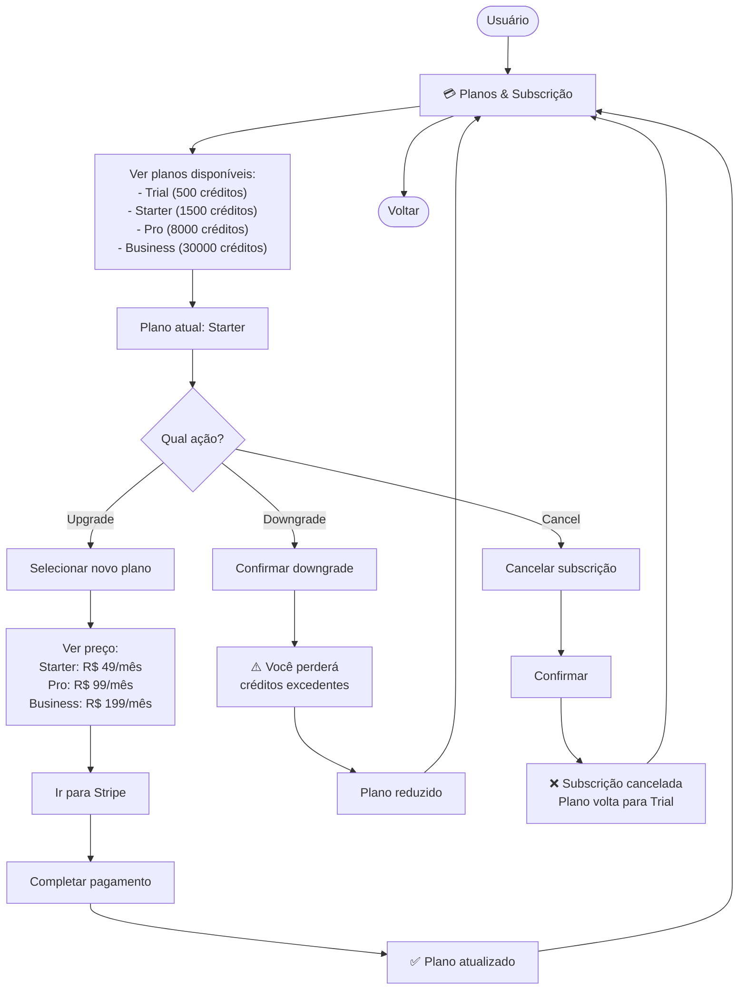
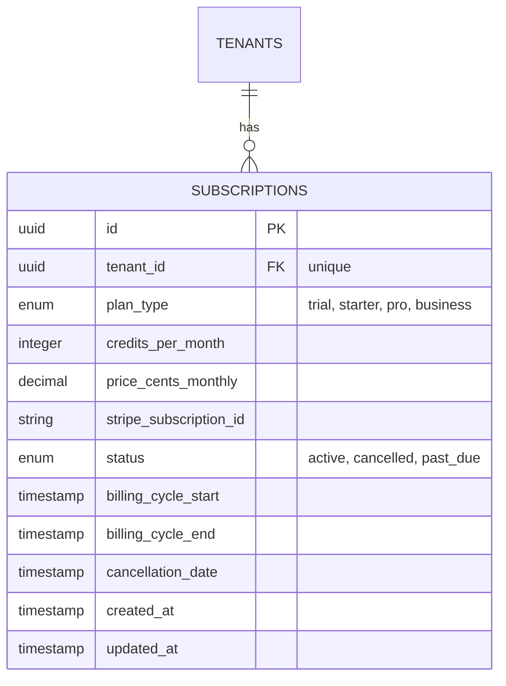

# 10-Plans — Fluxo

## User Flow



## Wireframes

```
┌─────────────────────────────────────────────────────────┐
│  Planos & Subscrição                       [← Voltar]   │
├─────────────────────────────────────────────────────────┤
│                                                         │
│  Sua Subscrição Atual                                   │
│  ╔═════════════════════════════════════════════════╗   │
│  ║ 🟢 Starter — R$ 49/mês                         ║   │
│  ║                                                 ║   │
│  ║ ✅ 1.500 créditos/mês                           ║   │
│  ║ ✅ Agendamentos ilimitados                      ║   │
│  ║ ✅ Até 3 profissionais                          ║   │
│  ║ ✅ Lembretes automáticos                        ║   │
│  ║ ✅ Dashboard básico                             ║   │
│  ║                                                 ║   │
│  ║ Próxima renovação: 18/06/2026                   ║   │
│  ║ [ Cancelar Subscrição ]                         ║   │
│  ╚═════════════════════════════════════════════════╝   │
│                                                         │
│  ─────────────────────────────────────────────────────  │
│                                                         │
│  Outros Planos Disponíveis                              │
│                                                         │
│  ┌──────────────────┐ ┌──────────────────┐             │
│  │ 🆓 Trial         │ │ 💎 Pro           │             │
│  │ (Upgrade Plan)   │ │ R$ 99/mês        │             │
│  │                  │ │                  │             │
│  │ 500 créditos     │ │ 8.000 créditos   │             │
│  │ [ Manter ]       │ │ [ Upgrade ]      │             │
│  └──────────────────┘ └──────────────────┘             │
│                                                         │
│  ┌──────────────────┐                                   │
│  │ 🏢 Business      │                                   │
│  │ R$ 199/mês       │                                   │
│  │                  │                                   │
│  │ 30.000 créditos  │                                   │
│  │ [ Upgrade ]      │                                   │
│  └──────────────────┘                                   │
│                                                         │
└─────────────────────────────────────────────────────────┘
```

## ERD


