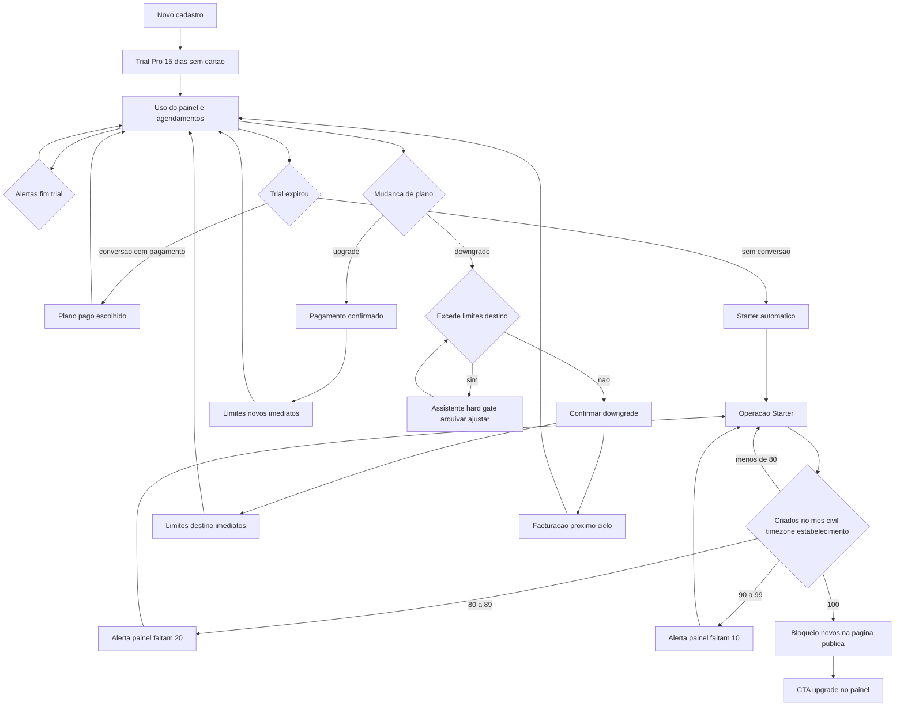

# Módulo 09 — Planos: fluxo do utilizador (AgendaIA)

Visão resumida: trial Pro → uso → conversão ou Starter automático; Starter → alertas de volume → possível cap na página pública; upgrade e downgrade (com gate).

Detalhe: [USER_STORIES.md](../../USER_STORIES.md), [step-by-step.md](../../step-by-step.md), [states.md](../state-diagram/states.md).

---

## Planos (referência)

| Plano | Estabelecimentos | Profissionais | Agendamentos/mês |
|-------|------------------|----------------|------------------|
| Starter | 1 | até 2 | até 100 |
| Pro | até 3 | até 10 por estabelecimento | ilimitado |
| Business | até 10 | ilimitado | ilimitado |

Trial: **15 dias Pro**, sem cartão; cartão só na **conversão**. Fim do trial sem pagamento: **Starter automático**.

---

## Flowchart — trial, limite Starter, upgrade e downgrade

---

## Notas de leitura do diagrama

- **Contador mensal:** zera no **dia 1** no timezone do estabelecimento; ver [step-by-step.md](../../step-by-step.md).
- **Upgrade:** após pagamento, **limites** imediatos; levantamento do cap público se o novo plano for ilimitado em agendamentos.
- **Downgrade:** **não** conclui com conflito; **assistente** até conformidade; **dados preservados**; cobrança ao novo tier no **próximo ciclo** após confirmação.

---

## Referências

- [USER_STORIES.md](../../USER_STORIES.md)  
- [step-by-step.md](../../step-by-step.md)  
- [states.md](../state-diagram/states.md)
